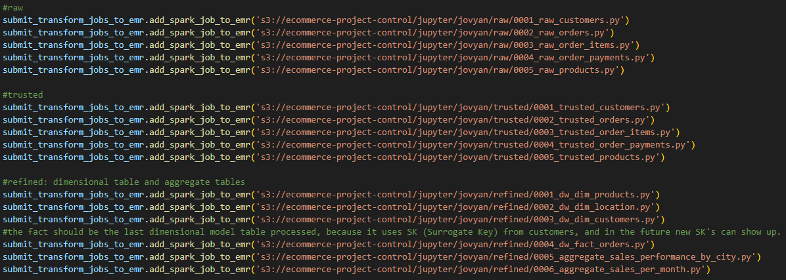

# Brazilian Ecommerce Data Engineering Project
### Intro

This project uses a data from Klagle, about a Brazilian ecommerce public dataset of orders made at Olist Store. The dataset has information of 100k orders from 2016 to 2018 made at multiple marketplaces in Brazil. Its features allows viewing an order from multiple dimensions, like location, customers and products. This is real commercial data and because of it has been anonymised.

The chosen data stack is well-known and established in the industry, where our objective is to build a robust Data Lakehouse, leveraging services from AWS and Delta Lake, developed by Databricks and now open source.

### Data Architecture

### Data Ingestion and Transformation

A Python script called "orchestrator.py" is responsible to orchestrate the ingestion and spark transformation jobs in our data pipeline. The utilization of the lib boto3 in Python is very important to manipulate the AWS Resources automacally.

<ul>
    <li>All the csv files in our on-premisse machine is send to our landzone bucket in S3.</li>
    <li>Then, our AWS EMR Cluster with Spark, JupyterHub, Livy and Hadoop is created. The Delta Lake is not a simple option to use at EMR when creating it, so for our orchestrator it is necessary to execute a boostrap action to copy the Delta Core and Storage JARS from our S3 and install him correctly in our cluster.</li>
    <li>The cluster creation take time, and because of that, it is necessary to our orchestrator create and monitoring until the cluster is totally created.</li>
    <li>When the orchestrator checks that the cluster is created and waiting to jobs, it submits our spark jobs saved in S3 to the cluster and the data transformations really begins. The raw jobs collect data from landzone and append in raw zone, reading the data from raw zone and merging in silver to only new data and then at refined creating star schemas and aggregated tables.</li>

</ul>

### Serving to our end-users the trusted and refined data

