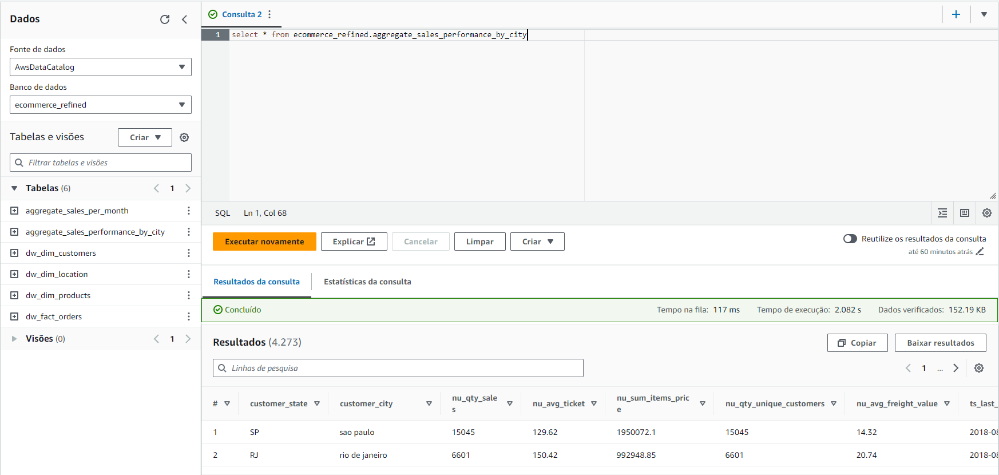

# Brazilian Ecommerce Data Engineering Project
### Intro

This project utilizes data obtained from Kaggle, specifically a Brazilian ecommerce public dataset of orders made at Olist Store. The dataset encompasses information from 100,000 orders spanning the years 2016 to 2018, originating from various marketplaces in Brazil. The dataset's rich features enable the exploration of orders from multiple perspectives, including location, customers, and products. It's important to note that this dataset contains genuine commercial data that has undergone anonymization for privacy and confidentiality purposes.

The selected data stack is widely recognized and established within the industry. Our goal is to construct a robust Data Lakehouse by harnessing services from AWS (Amazon Web Services) and Delta Lake, a technology initially developed by Databricks and now available as an open-source project. This strategic combination of tools and platforms ensures a powerful and scalable infrastructure.

### Data Architecture

### Data Pipeline
#### Orchestrator

    In our data pipeline, the orchestration of ingestion and Spark transformation jobs is managed by a Python script named "orchestrator.py". This script plays a pivotal role in coordinating and executing various tasks, ensuring the smooth flow and processing of data throughout the pipeline.

The use of the "boto3" library and Object-Oriented Programming (OOP) techniques in Python is crucial for automating the manipulation of AWS resources. This approach not only enables the efficient management of AWS resources but also promotes code reusability, significantly reducing the likelihood of errors in the data pipeline. By employing "boto3" and embracing OOP principles, we enhance the maintainability and scalability of our code while automating AWS-related tasks with precision and reliability.

#### Data Transformation

<ul>
    <li>All the CSV files on our on-premises machine are sent to our "landzone" bucket in S3.</li>
    <li>Subsequently, our AWS EMR Cluster with Spark, JupyterHub, Livy, and Hadoop is created. Since Delta Lake is not a straightforward option for EMR during creation, our orchestrator executes a bootstrap action to copy the Delta Core and Storage JARS from our S3 and installs them correctly in our cluster.</li>
    <li>The cluster creation takes anywhere from 5 to 9 minutes, necessitating our orchestrator to create and monitor it until the cluster is fully operational. Once the orchestrator confirms that the cluster is created and ready for jobs, it submits our Spark jobs saved in S3 to the cluster, initiating the data transformation process.</li>
    <li>The raw Spark jobs are responsible for collecting data from the "landzone" and appending it to the raw zone in Delta Lake format. After the raw zone is completely processed, the trusted Spark jobs read the new data from the raw zone and merge it into the trusted zone, updating and inserting new data, thanks to Delta Lake.</li>
    <li>The data in the "landzone" is deleted after being processed in the raw zone without errors.</li>
    <li>In the raw zone and beyond, the data is already saved in Delta format, enabling features such as ACID transactions, schema enforcement, time travel, etc.</li>
</ul>

<ul>
<li>After the trusted zone is fully processed, the refined Spark jobs begin, generating the star schema tables, including dimensions with SCD 1, SCD 2, and facts. Additionally, aggregated tables are created from the trusted tables, providing a comprehensive and structured representation of the transformed data.</li>
</ul>

### Making the refined zone available to our end-users for analysis

    The data we provide in our refined zone goes through careful changes and checks, following the Kimball Dimensional Model with facts and dimensional tables. This makes sure that the data is well-prepared and safe for users to use without any problems related to analytics, like slow performance, repeated information, wrong data types, invalid data, and complicated relationships like in an normalized model. Our careful handling ensures a reliable and good-quality dataset that's easy for people to use for analysis.

    We plan to use AWS services to provide our users with the refined data in two ways:

<ul>
    <li><strong>AWS Quicksight:</strong> This is an AWS tool for visualizing data through charts. We will feed it with the queryable data from AWS Athena.</li>
    <li><strong>AWS Athena:</strong> This allows us to easily query our data in S3 using SQL in a user-friendly interface. It's a serverless solution that charges based on the amount of data scanned. The queried data can be utilized in BI tools such as AWS Quicksight and Power BI.</li>
</ul>

    Thanks to these two tools, users familiar with SQL can have more flexibility accessing and manipulating data from the refined zone. For users who aren't familiar with SQL, they can visualize and create charts within AWS Quicksight using saved queries made by someone or even generated by AI.

#### AWS Quicksight Charts
##### Orders by day

##### Orders by state

